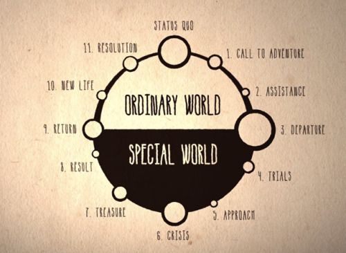

# How to Ruin a Good Story

---

# Theory

---

# Vladimir Propp

---

# Morphology of the Folktale

---

# Joseph Campbell

---

# Hero with 1000 Faces/Power of Myth

---

# TVTropes.org

---

# Kill Him Already

---

# It's Fun to Classify Things

---

# Hero

---

# False Hero

---

# Dispatcher

---

# Donor

---

# Helper

---

# Princess/Prize

---

# Villain

---

# So What?

---

# This is my father

---

# Patterns Are Interesting

---

# Differences Are Interesting

---

# Role Models Are Important

---

# The Power of Myth

*Moyers:* Unlike heroes such as Prometheus or Jesus, we're not going on our journey to save the world but to save ourselves.
*Campbell:* But in doing that you save the world. The influence of a vital person vitalizes, there's no doubt about it. The world without spirit is a wasteland.
